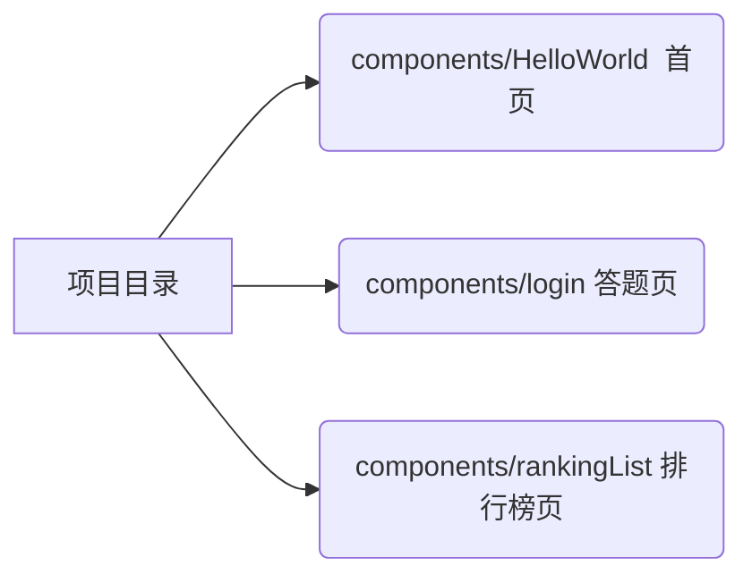

# game

> A Vue.js project

## Build Setup

``` bash
# install dependencies
npm install

# serve with hot reload at localhost:8080
npm run dev

# build for production with minification
npm run build

# build for production and view the bundle analyzer report
npm run build --report

# run unit tests
npm run unit

# run e2e tests
npm run e2e

# run all tests
npm test
```
## 说明
src/issueData.js文件为第一次活动的问题 
src/issueData2.js文件为第二次活动的问题 
src/method.js 中 24行 product 	来控制本地 线上 测试    weixin.isweixin来判断是否在微信端打开




For a detailed explanation on how things work, check out the [guide](http://vuejs-templates.github.io/webpack/) and [docs for vue-loader](http://vuejs.github.io/vue-loader).
